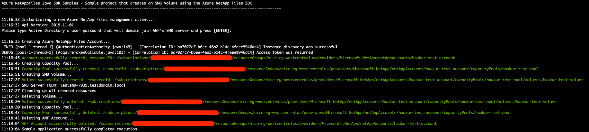

# Azure NetApp Files SDK Sample - SMB Volume for Java

This project demonstrates how to use a Java sample application to create an SMB Volume for the Microsoft.NetApp
resource provider.

In this sample application we perform the following operations:

* Creations
    * NetApp account
    * Capacity pool
    * SMB volume
* Deletions
    * SMB volume
    * Capacity pool
    * NetApp account

>Note: The cleanup execution is disabled by default. If you want to run this end to end with the cleanup, simply
>change the value of boolean variable 'cleanup' in main.java. 

If you don't already have a Microsoft Azure subscription, you can get a FREE trial account [here](http://go.microsoft.com/fwlink/?LinkId=330212).

## Prerequisites

1. This project is built upon Maven, which must be installed in order to run the sample. See [instructions on installing Maven](https://maven.apache.org/install.html). 
1. The sample is written in Java 11. The Maven compiler's target Java version is therefore Java 11, and the JAVA_HOME environment variable must be set to Java 11 or a newer version.
See [instructions on setting JAVA_HOME for windows](https://mkyong.com/java/how-to-set-java_home-on-windows-10/),
and [instructions on setting JAVA_HOME for macOS](https://mkyong.com/java/how-to-set-java_home-environment-variable-on-mac-os-x/).
1. Azure subscription
1. Subscription needs to be enabled for Azure NetApp Files. For more information, see
[Submit a waitlist request for accessing the service](https://docs.microsoft.com/azure/azure-netapp-files/azure-netapp-files-register#waitlist).
1. Resource Group created
1. Virtual Network with a delegated subnet to Microsoft.Netapp/volumes resource. For more information, see 
[Guidelines for Azure NetApp Files network planning](https://docs.microsoft.com/en-us/azure/azure-netapp-files/azure-netapp-files-network-topologies).
1. For this sample console application to work, authentication is needed. We will use Service Principal based authentication.
    1. Within an [Azure Cloud Shell](https://docs.microsoft.com/en-us/azure/cloud-shell/quickstart) session, make sure
    you're logged in at the subscription where you want to be associated with the service principal by default:
        ```bash
        az account show
       ```
         If this is not the correct subscription, use:             
         ```bash
        az account set -s <subscription name or id>  
        ```
    1. Create a service principal using Azure CLI:
        ```bash
        az ad sp create-for-rbac --sdk-auth
        ``` 
       
       >Note: This command will automatically assign RBAC contributor role to the service principal at subscription level.
       You can narrow down the scope to the specific resource group where your tests will create the resources.

    1. Copy the output contents and paste it in a file called azureauth.json, and secure it with file system permissions.
    1. Set an environment variable pointing to the file path you just created. Here is an example with Powershell and bash:
        
        Powershell
        ```powershell
        [Environment]::SetEnvironmentVariable("AZURE_AUTH_LOCATION", "C:\sdksample\azureauth.json", "User")
        ```
        Bash
        ```bash
        export AZURE_AUTH_LOCATION=/sdksamples/azureauth.json
        ```
    
## What does netappfiles-java-smb-sdk-sample do?

This sample is dedicated to demonstrate how to deploy a volume in Azure NetApp Files that uses SMB protocol. Similar to
other Azure NetApp Files SDK examples, the authentication method is based on a service principal. This project then will ask for the
Active Directory user password, and after validating that it is not null, it will create a single volume with a single
capacity pool using standard service level tier and finally the SMB volume.

There is a section in the code dedicated to remove created resources. By default, this script will not remove all created resources;
this behavior is controlled by a boolean variable called 'cleanup'. If you want cleanup right after the creation operations,
set this variable to 'true'.

SMB volumes will require that you have an Active Directory domain available for you to use, with the DNS Servers you will
define (as comma separated string) within the same virtual network (any subnet with exception of Azure NetApp Files volume's delegated subnet)
where your Azure NetApp Files service will use to setup its volumes. The username provided must be a user that has rights to
domain join computers. Although we setup Active Directory at the NetApp account level, the SMB server will be created only
when the volume gets deployed. Finally, you will notice that the SMB server created in AD will be appended with the
SMB Server prefix you configured plus a sequence of random characters, up to 15 in total name length.

>Note: This sample does not have a specific retrieve section, because we perform get operations in several
>places throughout the code.

## How the project is structured

The following table describes all files within this solution:

| Folder         | FileName                    | Description                                                                                                                                                                                                                                                               |
|----------------|-----------------------------|---------------------------------------------------------------------------------------------------------------------------------------------------------------------------------------------------------------------------------------------------------------------------|
| Root\\^           | main.java                   | Reads configuration, authenticates, executes all operations
| Root\\^\common    | CommonSdk.java              | Class dedicated to common operations related to Azure NetApp Files SDK
| Root\\^\common    | ResourceUriUtils.java       | Class that exposes a few methods that help parsing Uri's, building new Uri's, or getting a resource name from a Uri, etc
| Root\\^\common    | ServiceCredentialsAuth.java | A small support class for extracting and creating credentials from a File
| Root\\^\common    | Utils.java                  | Class that contains utility functions for writing output, retrieving AD password, etc.
>\\^ == src/main/java/smb/sdk/sample

## How to run the console application

1. Clone the SDK sample locally:
    ```powershell
    git clone https://github.com/Azure-Samples/netappfiles-java-smb-sdk-sample
    ```
1. Change folder to **.\netappfiles-java-smb-sdk-sample**:
1. Make sure you have the azureauth.json and its environment variable with the path to it defined (as previously described).
1. Make sure the JAVA_HOME environment variable is pointing to version 11 of Java or newer (see Prerequisites for instructions).
1. In the main.java class, change the values of the variables within the runAsync() function to reflect your environment.
1. Compile the console application:
    ```powershell
    mvn clean compile
    ```
1. Run the console application:
    ```powershell
    mvn exec:java -Dexec.mainClass="smb.sdk.sample.main"
    ```
   
Sample output


## References

* [Resource limits for Azure NetApp Files](https://docs.microsoft.com/azure/azure-netapp-files/azure-netapp-files-resource-limits)
* [Azure Cloud Shell](https://docs.microsoft.com/azure/cloud-shell/quickstart)
* [Azure NetApp Files documentation](https://docs.microsoft.com/azure/azure-netapp-files/)
* [Download Azure SDKs](https://azure.microsoft.com/downloads/)
